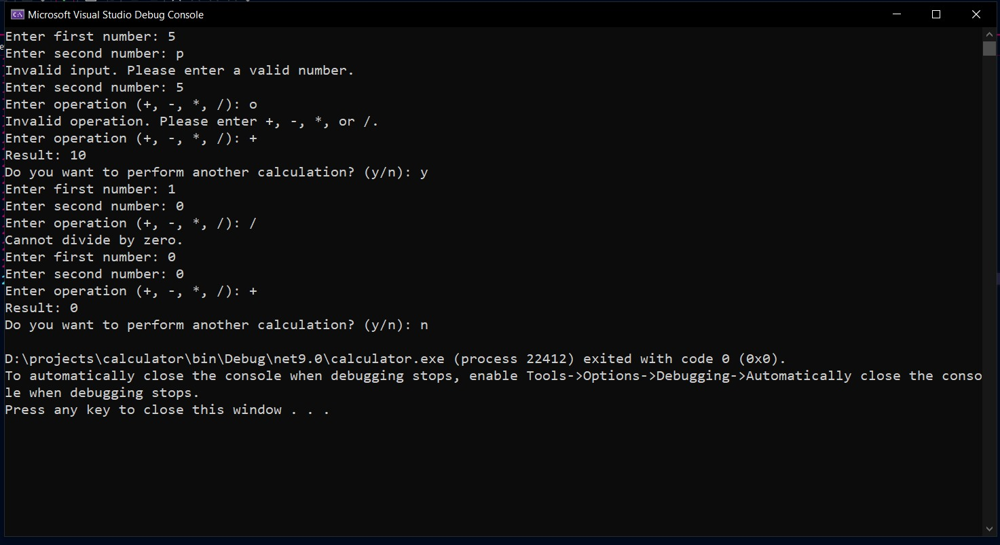

# Calculator

A simple console calculator application built with C# and .NET.

## Features

- Addition
- Subtraction
- Multiplication
- Division
- Input validation
- Division by zero handling
- Perform multiple calculations without restarting

## Technologies

- C#
- .NET

## How to Run

1. Clone the repository.
2. Open the solution in Visual Studio.
3. Build the project.
4. Run the application.

## Screenshot

